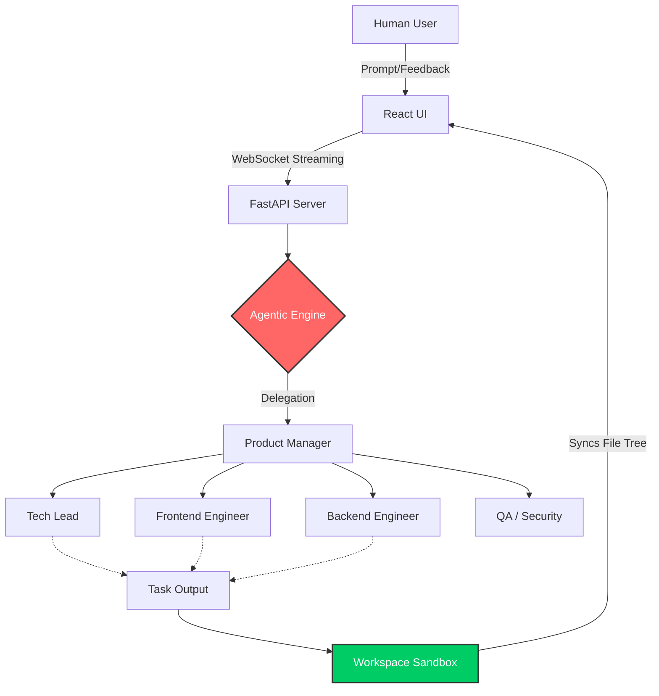

# AgentHub Studio

A fully capable, Human-in-the-Loop Cloud IDE powered by a hierarchical multi-agent framework (CrewAI) to automate and manage complex software engineering tasks.

  

## Tech Stack


## Features
- **Hierarchical Agent Teams**: Choose which AI specialists (Tech Lead, QA, Frontend, Backend, Librarian) to assign to your projects.
- **Bring Your Own Key (BYOK) & Security**: Enter your API keys directly into the UI (stored securely in your browser's localStorage). A real-time secret scrubber masks your API keys in the live logs and terminal output, ensuring your credentials are never leaked.
- **Glassmorphic IDE UI**: A hyper-modern, real-time code editor and terminal interface bundled into the browser.
- **Human-in-the-Loop (HITL)**: Agents will physically pause their execution to ask for human feedback, passwords, or clarification before proceeding.
- **Live WebSocket streaming**: See exactly what the AI engineers are thinking and building in real-time.
- **Isolated Workspaces**: Every project runs in a dedicated workspace, persisting files across sessions.

## Architecture
The system employs a Client-Server separation with an event-driven AI engine:



## Project Structure
- **`frontend/`**: Vite + React web application (The IDE).
- **`backend/`**: FastAPI (The Orchestrator) & CrewAI (The Brain).
- **`backend/workspaces/`**: Generative Sandbox where all code outputs are safely stored.

## Prerequisites
- **Python 3.11+**
- **Node.js 18+**
- **Google Gemini API Key**

## Local Setup

### 1. Backend Setup
```bash
cd backend
python -m venv .venv

# Windows activation
.\.venv\Scripts\activate
# Mac/Linux activation
source .venv/bin/activate

pip install -r requirements.txt
```
Create a `.env` in the `backend/` directory:
```env
GEMINI_API_KEY=your_key_here
```

### 2. Frontend Setup
```bash
cd frontend
npm install
```

### 3. Run Locally
**Terminal 1 (Backend):**
```bash
cd backend
uvicorn server:app --reload --port 8000
```

**Terminal 2 (Frontend):**
```bash
cd frontend
npm run dev
```

## Cloud Deployment (Vercel & Render)
This project is pre-configured as a Monorepo for zero-downtime CI/CD:
1. Connect Render to the repository. It will automatically detect `render.yaml` and deploy the Python API. Add `GEMINI_API_KEY` to your environment settings.
2. Connect Vercel to the repository. Set the Root Directory to `frontend`.
3. Add `VITE_API_URL` and `VITE_WS_URL` in Vercel pointing to your Render backend.

## Future Scope
Here is how AgentHub can evolve going forward:
- [ ] **Docker Sandboxes**: Execute generated Python/Node code dynamically via "Code Executor" agents inside secure Docker containers.
- [ ] **Web Search Tools**: Attach DuckDuckGo capabilities to the Librarian agent for up-to-date documentation scraping.
- [ ] **GitHub Integration**: A DevOps agent capable of initializing Git repos in the workspace and directly pushing finished products to GitHub.
- [ ] **File Modifier Tool**: Transitioning from full-file overwrites to multi-replace diffing for large-scale application debugging.

## License
This project is licensed under the MIT License - see the [LICENSE](LICENSE) file for details.
